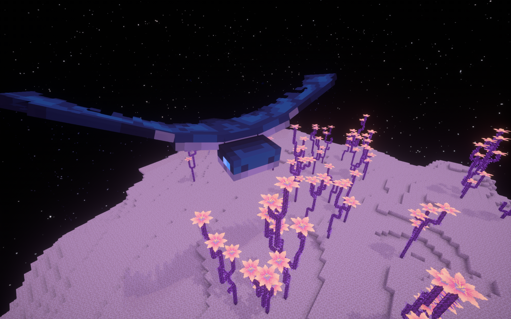

# King Phantom

**King Phantom** is a rare version of a regular **Phantom**, but it's way bigger, tougher and stronger. **A King of all Phantoms**.

## King Phantom

<table>
  <thead>
    <tr>
      <th style="text-align:left">Health</th>
      <th style="text-align:left">Armor</th>
      <th style="text-align:left">Behaviour</th>
      <th style="text-align:left">Spawning</th>
      <th style="text-align:left">Attack Strenght</th>
    </tr>
  </thead>
  <tbody>
    <tr>
      <td style="text-align:left"><b>500</b> (250 x &#x2764; ) + <b>40</b> (absorption, 20 x &#x1F49B;)</td>
      <td
      style="text-align:left"><b>25</b>
        </td>
        <td style="text-align:left"><b>Hostile</b>
        </td>
        <td style="text-align:left"><b>0.005%</b> chance to spawn in place of regular phantom</td>
        <td style="text-align:left">
          
<b>TBA</b> (We only know that he can kill a Player with

          
<b>full Netherite</b> armour in <b>1 attack</b>)

        </td>
    </tr>
  </tbody>
</table>

## **Appearance**

Well, what can I say, it's just a **giant Phantom** that flies over the sky and **kills anyone on his way**.

**King Phantom** always comes with additional protection in form of **5 Royal Guards**.

## Spawning

**King Phantom** has a small chance \(**0.005%**\) of spawning in the place of normal **Phantom**, which means that he can spawn in any dimension - **naturally** in the **Overworld**, in **Withering Forest** in the **Nether** and from **Endermen** in **all dimensions**.

Upon spawn all players will hear a **Phantom scream** and slowed down **Wither** spawn sound. Then it's just all about locating the **King**. And then defeating him. Good luck...

## Drops

If someone somehow manages to defeat Phantom King, the drops are really rewarding.

* 0 - \(22 + Looting x 7\) of **Phantom Membrane**
* **King Phantom's Wings** \(Mythical Elytra, more info in [Other Items](../../items/other-items.md)\)

## Royal Guard \(Phantom King\)

<table>
  <thead>
    <tr>
      <th style="text-align:left">Health</th>
      <th style="text-align:left">Armor</th>
      <th style="text-align:left">Behaviour</th>
      <th style="text-align:left">Spawning</th>
      <th style="text-align:left">Attack Strenght</th>
    </tr>
  </thead>
  <tbody>
    <tr>
      <td style="text-align:left"><b>100</b> (50 x &#x2764;)</td>
      <td style="text-align:left"><b>15</b>
      </td>
      <td style="text-align:left"><b>Hostile</b>
      </td>
      <td style="text-align:left">
        
Always spawns in group of <b>5</b>
        

        
next to <b>King Phantom</b>
        

      </td>
      <td style="text-align:left"><b>TBA</b>
      </td>
    </tr>
  </tbody>
</table>

## Info

**Royal Guards** are much smaller than their **King**, but still pretty **deadly**. They will **protect** their **King**, no matter what it takes.

They **always** spawn in group of **5** next to their **King**.

Upon death, they drop regular **Phantom loot**, so their only purpose is to **protect their Lord**

